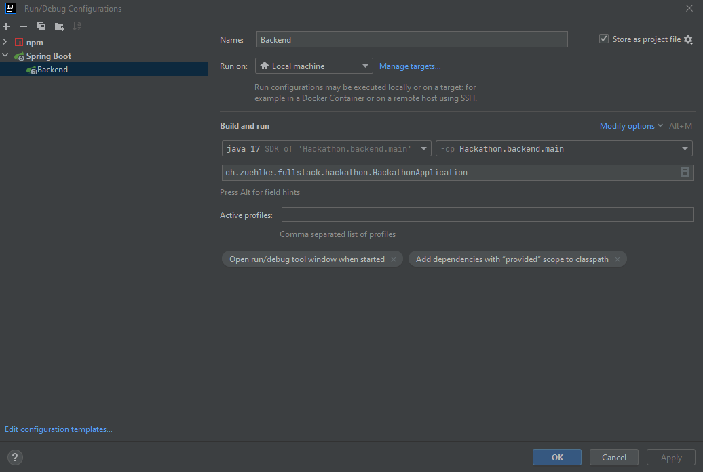

# Java Fullstack Hackathon 2021

---

## Setup

If your setup already has some of the required tools installed, please adjust accordingly.

1. Install Node 12.14.1 from here https://nodejs.org/en/blog/release/v12.14.1/
2. Run `npm install -g npm@7.23.0`
3. Run `npm install -g @angular/cli@12.2.4`
4. Verify your versions with `ng version`:  
   Angular CLI: **12.2.4**  
   Node: **12.14.1**  
   Package Manager: **npm 7.23.0**
4. Install a new version of IntelliJ
5. Clone the master branch with `git clone https://github.com/Cyberdog52/hackathon.git`
6. Open the project with IntelliJ and let gradle build the project
7. Install the npm dependencies with `cd frontend` followed by `npm install`

During the hackathon your team can decide to use a custom branch on this GitHub repository or to fork it to your own
private repository.

## Run

### Start backend

1. Start the backend either by
    1. executing `./gradlew bootRun`
    2. or by creating a run configuration of type SpringBoot pointing to *
       ch.zuehlke.fullstack.hackathon.HackathonApplication*
       

You should be able to open the Swagger endpoint documentation at `http://localhost:8080/swagger-ui.html`.

### Start frontend

1. By executing `cd frontend` followed by `npm start`
2. Or by creating a run configuration of type **npm** pointing to *hackathon\frontend\package.json* with the script **
   start**
   

You should now be able to open `http://localhost:4200` to access the frontend.

Now you should see the following screen:

## Insight API

We highly encourage you to use the Insight API.  
You can find the API documentation in json format at https://insight.zuehlke.com/swagger/docs/v1 (VPN access required)
.  
To test the endpoints and to have a better overview of the API, we recommend you to import this API into Postman.
Unfortunately the official Swagger documentation at
https://insight.zuehlke.com/swagger/ui/index
is not working at the time of this writing. Here is how you can test the Insight API locally:

1. Install Postman from https://www.postman.com/downloads/
2. On the top-left corner in Postman click **Import** and select **Link**
3. Enter https://insight.zuehlke.com/swagger/docs/v1 in the link and press **Continue**
   
4. On the next screen, you can verify the collection name (WebApi), format (Swagger 2.0) and Import as (API). Click **
   Import**. This may take a while.
5. You will see the new collection 'WebApi' under collections
6. For any request you will have to adjust the Auth tab to be **Basic Auth**. User: *your Zuehlke email address*.
   Password: *your Zuehlke password*. Be careful that you do not share this!
   

## Other API ideas

- Weather

- Google Maps

- Twitter

- Youtube

- RapidApi

- Tmdb
